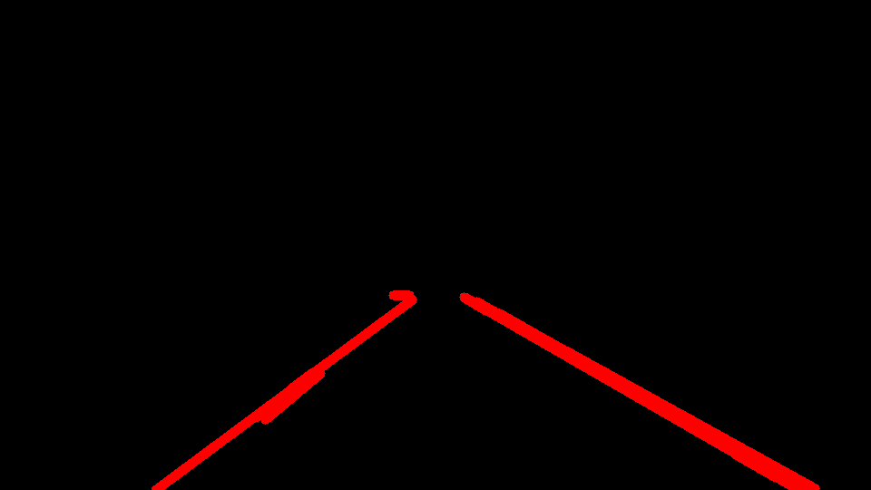
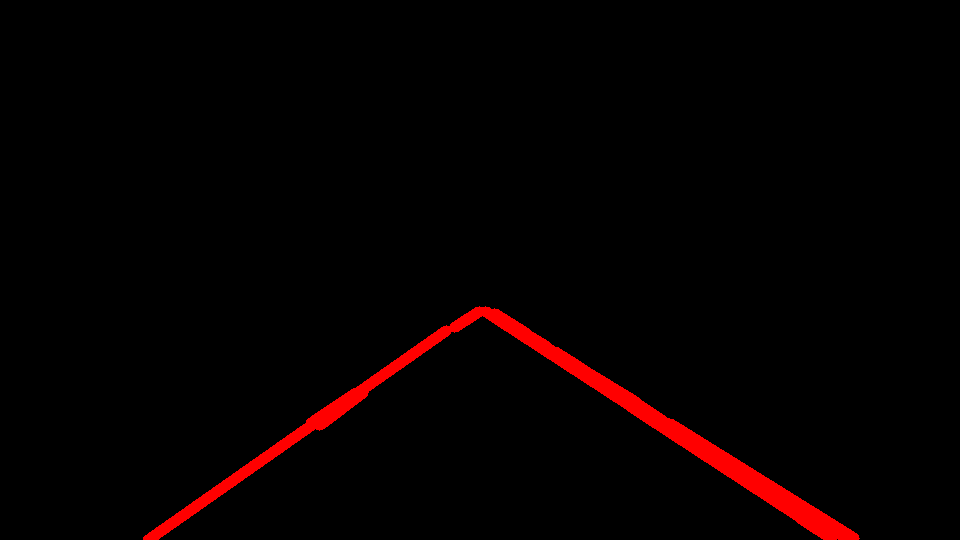
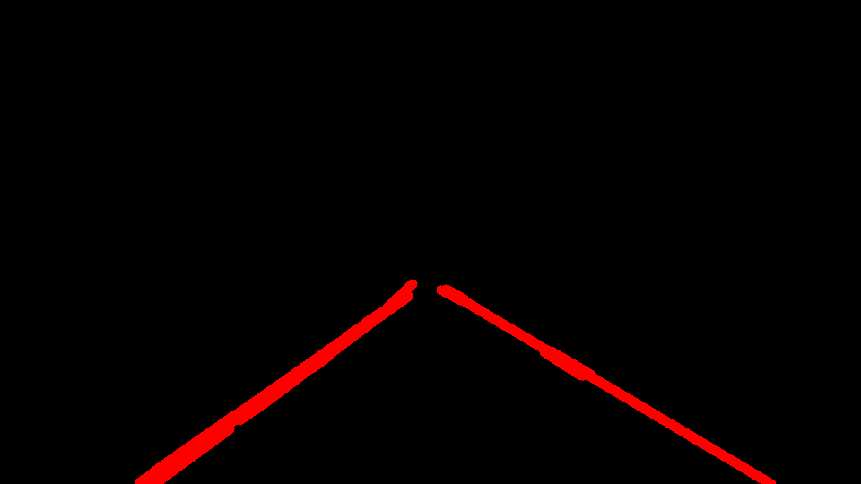
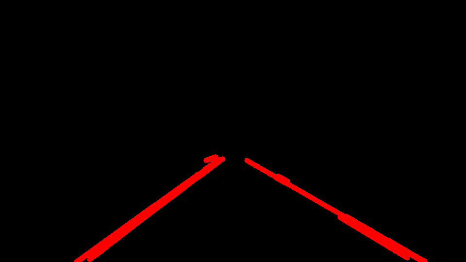
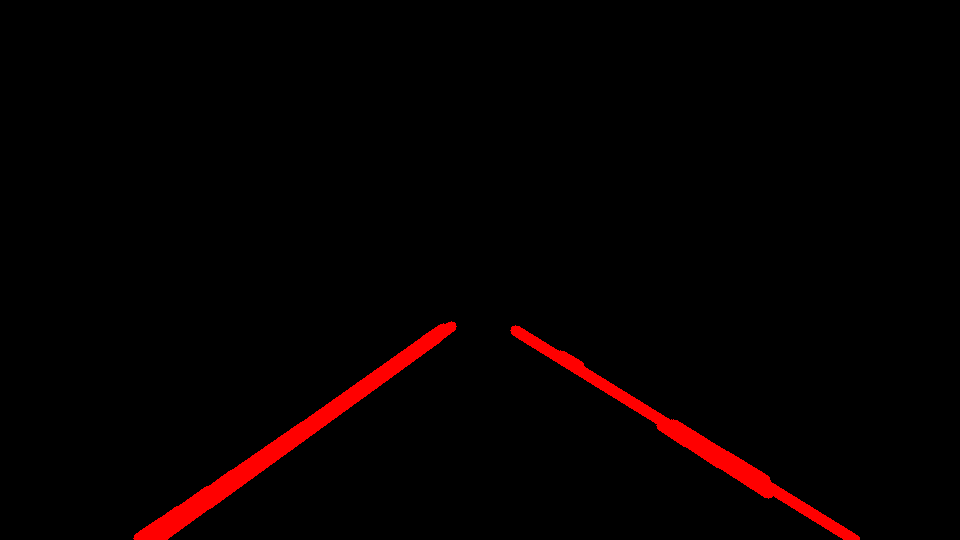
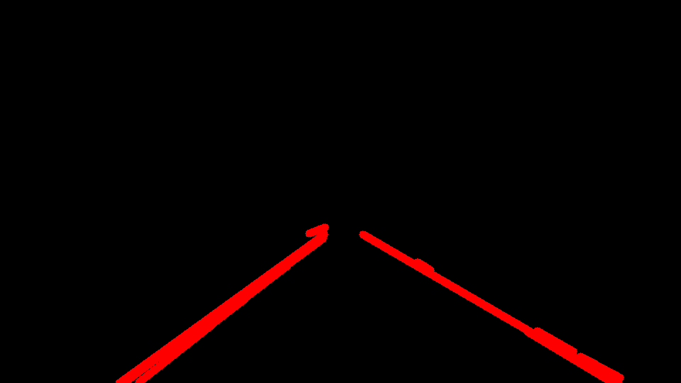

# **Finding Lane Lines on the Road**

## Writeup by Matthew Jones

### Project: CarND-LaneLines-P1

---

**Finding Lane Lines on the Road**

The goals / steps of this project are the following:
* Make a pipeline that finds lane lines on the road
* Reflect on your work in a written report

[//]: # (Image References)

---

### Reflection

### 1. Describe your pipeline. As part of the description, explain how you modified the draw_lines() function.

My image processing pipeline consisted of 5 steps:
 1. Convert image to gray scale
 2. Apply Gaussian blur
 3. Apply Canny transform to detect edges
 4. Mask image with a poylgon (4 vertices)
 5. Draw lines on a blank image with average gradients of lines detected by Hough transform

In order to draw a single line on the left and right lanes, I modified the draw_lines() function by:
 * separating left-side(+) and right-side(-) lines
 * calculating their average slope
 * drawing the average line only on left and right side of the image.

Here are the inputs and outputs of the pipeline:

**Solid White Curve Line**
 

**Solid White Curve Line** - _Processed_
 

**Solid White Right Line**
 

**Solid White Right Line** - _Processed_
 

**Solid Yellow Curve Line**
 

**Solid Yellow Curve Line** - _Processed_
 

**Solid Yellow Curve2 Line**
 

**Solid Yellow Curve Line2** - _Processed_
 

**Solid Yellow Left Line**
 

**Solid Yellow Left Line** - _Processed_
 

**White Car Lane Switch Line**
 

**White Car Lane Switch Line** - _Processed_
 

### 2. Identify potential shortcomings with your current pipeline

Potential shortcomings of my current pipeline include:
 * does not work with the challenge video
 * it is not drawing a single left-side and single right-side lines when the road markings are dotted lines
 * white cars switching lanes are not well handled

### 3. Suggest possible improvements to your pipeline

Possible improvements could include:
 * handling when colour of the road changes due to shadow
 * handling when colour of the road changes due to change in road material (eg. tarmac to concrete)
